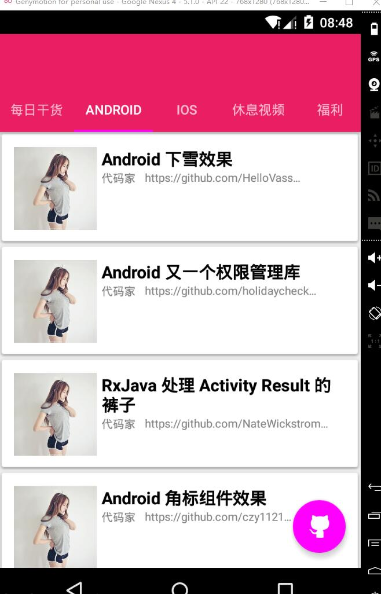

# Meizhi
android小白练手项目---妹子App

##目前进展

**2016-10-1**  
自定义实现Fragment懒加载，支持Fragment可见时加载数据，离开时隐藏加载动画，返回时根据加载状态自动显示或隐藏加载动画  

**2016-9-28**
添加干货（android）的布局（待完善）

**2016-9-26**
添加Tablayout + ViewPager布局

**2016-9-26前**
引入GreenDao数据库框架  
引入Picasso图片加载框架  
首页瀑布流界面完成  
引入Retrofit2网络访问框架  
引入Glidet图片框架

效果：  

