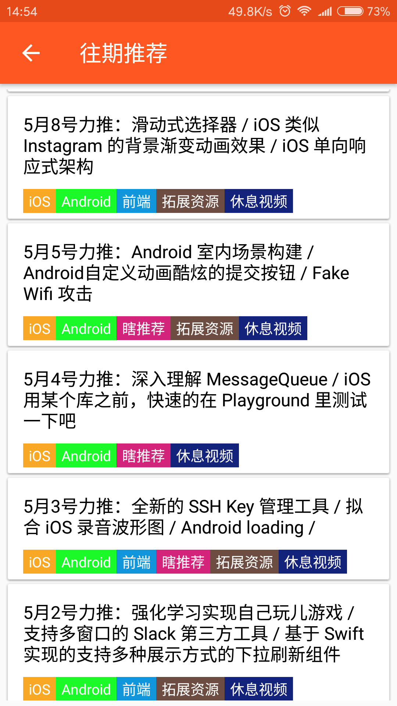
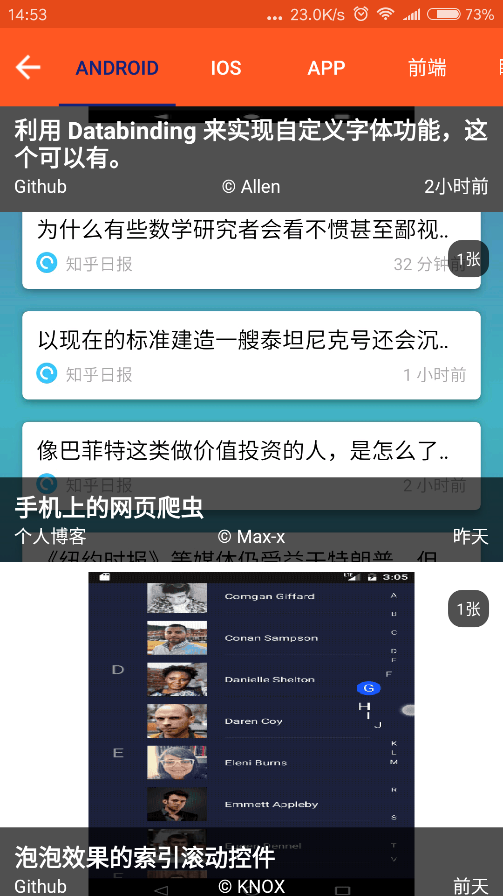
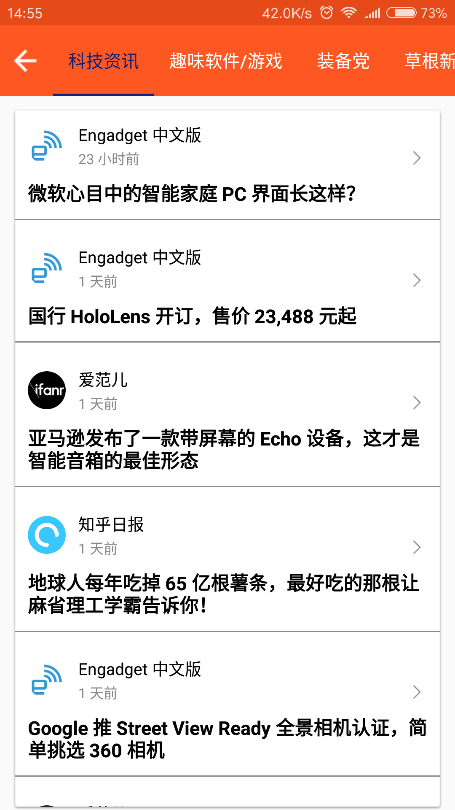
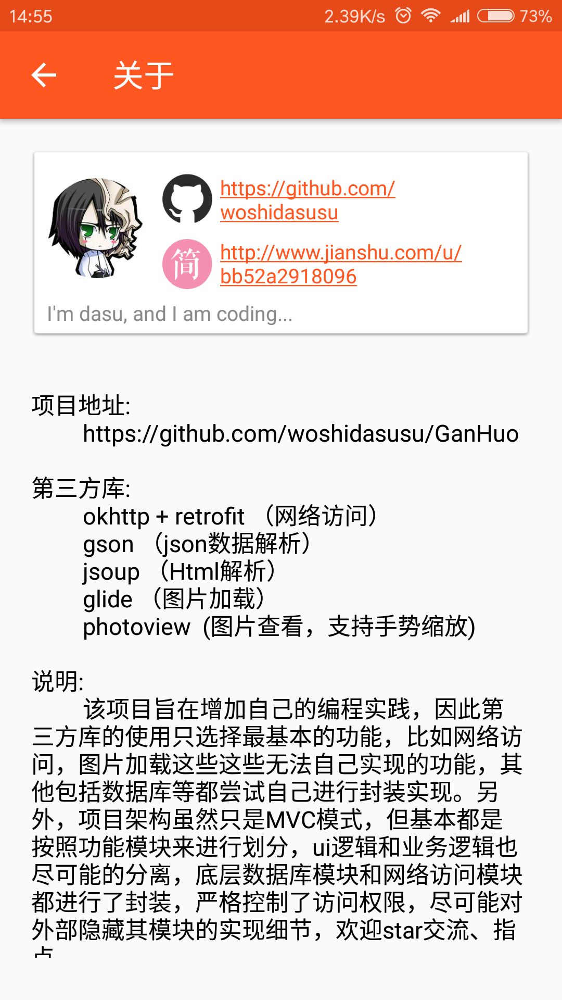

# GanHuo  

 

 

 

## 介绍

Gank平台的移动端又来了，本项目在架构方面有稍微花点心思，虽然还是最简单的MVC模式，但基本参考MVP的思想，Activity只负责ui显示逻辑，ui和业务会尽量的分离开，每个包的类权限严格控制，尽量对外部隐藏其实现细节。另外，本项目不像其他热门的Gank客户端那样使用诸如Rx系列的高级开源库，代码应该是可以很容易看懂的，吧。哈哈，有兴趣的可以fork看看，有什么问题可以联系我哈。  

以下是项目所依赖的第三方库：

- Retrofit + Okhttp （网络访问）   
- Gson （Json数据解析）  
- Glide （图片加载）  
- photoview （支持手势缩放的图片查看）  
- Jsoup （Html解析）

 
 

## App下载  

[Fir下载](http://fir.im/dasugankhuo)  

  

 
 

## 效果  

 
gif图有些长，2分多钟，慢慢看哦  

 

　　　
　　　
　　　
　　　
　　　  

 

## 鸣谢

[drakeet](https://github.com/drakeet/Meizhi)  

[CaMnter](https://github.com/CaMnter/EasyGank)  

[burgessjp](https://github.com/burgessjp/GanHuoIO)  

